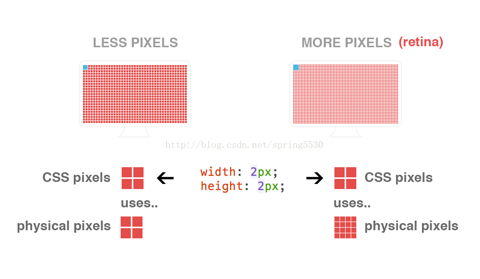

#[移动端多屏适配rem方案](https://blog.csdn.net/spring5530/article/details/54964316)

[原文出处](https://blog.csdn.net/spring5530/article/details/54964316)


###一、概念
1、物理像素(physical pixel)
一个物理像素是显示器(手机屏幕)上最小的物理显示单元，在操作系统的调度下，每一个设备像素都有自己的颜色值和亮度值。

2、设备独立像素(density-independent pixel)
设备独立像素(也叫密度无关像素)，可以认为是计算机坐标系统中得一个点，这个点代表一个可以由程序使用的虚拟像素(比如: css像素)，然后由相关系统转换为物理像素。

所以说，物理像素和设备独立像素之间存在着一定的对应关系，这就是接下来要说的设备像素比。

3、设备像素比(device pixel ratio )
设备像素比（简称dpr）定义了物理像素和设备独立像素的对应关系，它的值可以按如下的公式的得到：

设备像素比 = 物理像素 / 设备独立像素 // 在某一方向上，x方向或者y方向

在javascript中，可以通过`window.devicePixelRatio`获取到当前设备的dpr。

在css中，可以通过：
```css
-webkit-device-pixel-ratio，

-webkit-min-device-pixel-ratio，

 -webkit-max-device-pixel-ratio
 ```

进行媒体查询，对不同dpr的设备，做一些样式适配(这里只针对webkit内核的浏览器和webview)。

 

综合上面几个概念，一起举例说明下：

以iphone6为例：

1. 设备宽高为375×667，可以理解为设备独立像素(或css像素)。

2. dpr为2，根据上面的计算公式，其物理像素就应该×2，为750×1334。

用一张图来表现，就是这样：



上图中可以看出，对于这样的css样式：
```css
width: 2px;

height: 2px;
```
在不同的屏幕上(普通屏幕 vs retina屏幕)，css像素所呈现的大小(物理尺寸)是一致的，不同的是1个css像素所对应的物理像素个数是不一致的。

在普通屏幕下，1个css像素 对应 1个物理像素(1:1)。
在retina 屏幕下，1个css像素对应 4个物理像素(1:4)。

###二、视觉稿要求
1. 现主流的iphone6宽度750px（以前是iphone4的320)

2. 在设计过程中注意兼容最小尺寸（320），如图片中的文字、最小字体等...

问题：

1. 对于dpr=2的手机，为什么画布大小×2，就可以解决高清问题？

2. 对于2倍大小的视觉稿，在具体的css编码中如何还原每一个区块的真实宽高(也就是布局问题)?

### 三、图片问题
一个位图像素是栅格图像(如：png, jpg, gif等)最小的数据单元。每一个位图像素都包含着一些自身的显示信息(如：显示位置，颜色值，透明度等)。

1、retina下，图片高清问题
解决方案：@2x/@3x，然后图片容器缩小。

2、背景图片问题

解决方案：
```css

width: 200px;

height: 300px;

background-image: url(image@2x.jpg);

background-size: 200px 300px; // 或者: background-size: contain;
```
缺点：

1. 普通屏幕下同样下载了@2x的图片，造成资源浪费。

2. 普通屏幕下图片由于downsampling，会失去了一些锐利度(或是色差)。

所以最好的解决办法是：不同的dpr下，加载不同的尺寸的图片。

不管是通过css媒体查询，还是通过javascript条件判断都是可以的。

那么问题来了，这样的话，不就是要准备两套图片了嘛？(@1x 和@2x)

我想，做的好的公司，都会有这么一个图片服务器，通过url获取参数，然后可以控制图片质量，也可以将图片裁剪成不同的尺寸。

所以我们只需上传大图(@2x)，其余小图都交给图片服务器处理，我们只要负责拼接url即可。

如，这样一张原图：

https://img.alicdn.com/tps/TB1AGMmIpXXXXafXpXXXXXXXXXX.jpg // 原图

可以类似这样，进行图片裁剪：

// 200×200

https://img.alicdn.com/tps/TB1AGMmIpXXXXafXpXXXXXXXXXX.jpg_200x200.jpg

 

// 100×100

https://img.alicdn.com/tps/TB1AGMmIpXXXXafXpXXXXXXXXXX.jpg_100x100.jpg

(ps: 当然裁剪只是对原图的等比裁剪，得保证图片的清晰嘛~)

###四、border:1px问题
 

解决方案：border使用1px而非rem单位，且div的盒子模型为：border-box

这大概是前端最敏感，最关心的问题了。

先来，来看看下面的图：


上面两张图分别是在iphone3gs(dpr=1)和iphone5(dpr=2)下面的测试效果，对比来看，对于1px的border的展示，它们是一致的，并无区别。

那么retina显示屏的优势在哪里，设计师为何觉得高清屏下(右图)这个线条粗呢？明明和左右一样的~

还是通过一张图来解释：


上图中，对于一条1px宽的直线，它们在屏幕上的物理尺寸(灰色区域)的确是相同的，不同的其实是屏幕上最小的物理显示单元，即物理像素，所以对于一条直线，iphone5它能显示的最小宽度其实是图中的红线圈出来的灰色区域，用css来表示，理论上说是0.5px。